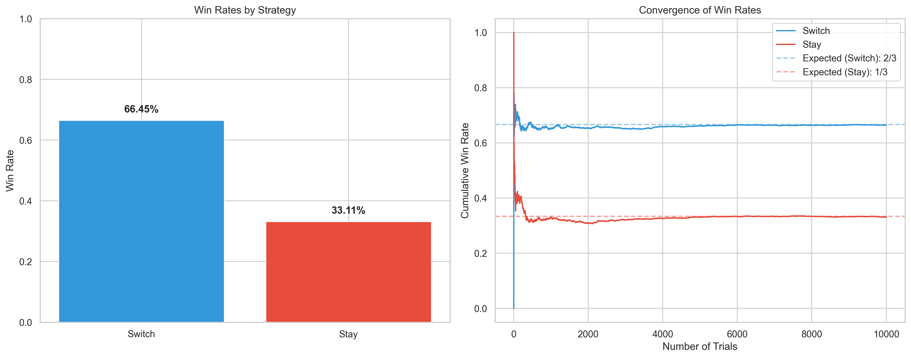

# Probability Puzzle Pack

This project contains simulations and visualizations for two classic probability puzzles:

1. **The Monty Hall Problem**: A counter-intuitive problem based on a game show scenario where switching doors leads to a higher probability of winning.
2. **Bertrand's Box Paradox**: A classic puzzle that demonstrates the subtleties of conditional probability.

## Project Structure

- `monty_hall_simulator.py`: Implementation of the Monty Hall Problem simulator
- `bertrands_box_simulator.py`: Implementation of Bertrand's Box Paradox simulator
- `probability_puzzles.ipynb`: Jupyter notebook with explanations and interactive demonstrations
- `probability_puzzles_report.md`: Markdown report for PDF generation
- `generate_pdf.py`: Script to convert the markdown report to PDF
- `requirements.txt`: List of required Python packages

## Setup and Installation

1. Clone this repository

2. Create and activate a virtual environment (optional but recommended):
   ```bash
   python -m venv venv
   source venv/bin/activate  # On Windows: venv\Scripts\activate
   ```

3. Install the required packages:
   ```bash
   pip install -r requirements.txt
   ```

4. For PDF generation, you'll need to install additional dependencies:
   - Pandoc: https://pandoc.org/installing.html
   - LaTeX (XeLaTeX): Depends on your operating system

## Running the Simulations

### Option 1: Using the Jupyter Notebook (Recommended)

1. Start Jupyter Lab or Jupyter Notebook:
   ```bash
   jupyter lab
   # or
   jupyter notebook
   ```

2. Open the `probability_puzzles.ipynb` notebook and run the cells in sequence.

### Option 2: Running the Python Scripts Directly

You can run each simulation script directly:

```bash
python monty_hall_simulator.py
python bertrands_box_simulator.py
```

This will run the simulations and generate the visualization images and animations.

## Generating the PDF Report

After running the simulations (which will generate the necessary images), you can generate the PDF report using:

```bash
python generate_pdf.py
```

This will convert `probability_puzzles_report.md` to `probability_puzzles_report.pdf`.

If you encounter any issues with PDF generation, check that you have properly installed:
1. Pandoc
2. A LaTeX distribution (such as TeX Live, MacTeX, or MiKTeX)

For detailed installation instructions, run `python generate_pdf.py` and follow the prompts.

## Outputs

The simulations will produce:

- Terminal outputs showing the results of the simulations
- Static visualizations saved as PNG files:
  - `monty_hall_results.png` 
  - `monty_hall_visualization.png`
  - `bertrands_box_results.png`
  - `bertrands_box_visualization.png`
- Animated visualizations saved as GIF files:
  - `monty_hall_animation.gif`
  - `bertrands_box_animation.gif`
- A comprehensive PDF report: `probability_puzzles_report.pdf`

## Mathematical Background

Both puzzles demonstrate how our intuition about probability can sometimes lead us astray. The correct solutions (switch doors in Monty Hall, and 2/3 probability in Bertrand's Box) are counter-intuitive to many people on first encounter.

The notebook and report provide detailed explanations of the mathematical reasoning behind each puzzle, along with visualizations to help understand the concepts.

## Requirements

- Python 3.7 or higher
- NumPy
- Matplotlib
- Seaborn
- Pandas
- Jupyter Lab/Notebook
- Pillow (for saving animations)
- Pandoc and LaTeX (for PDF generation)

## References

1. Selvin, S. (1975). "A problem in probability (letter to the editor)." *The American Statistician*, 29(1), 67.
2. vos Savant, M. (1990). "Ask Marilyn." *Parade Magazine*, 15.
3. Bertrand, J. (1889). *Calcul des probabilités*. Gauthier-Villars.
4. Rosenhouse, J. (2009). *The Monty Hall Problem: The Remarkable Story of Math's Most Contentious Brain Teaser*. Oxford University Press. 
