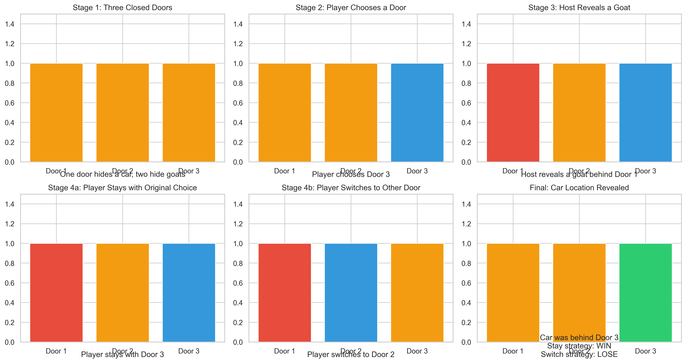
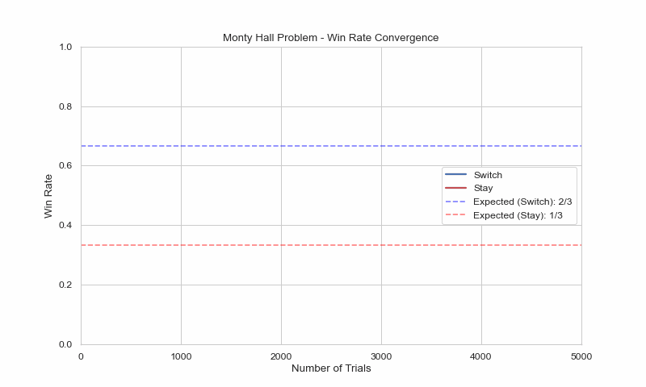
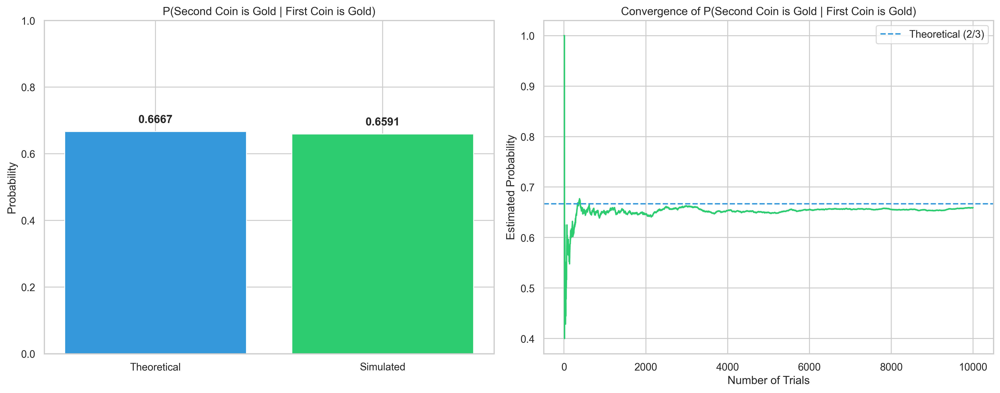
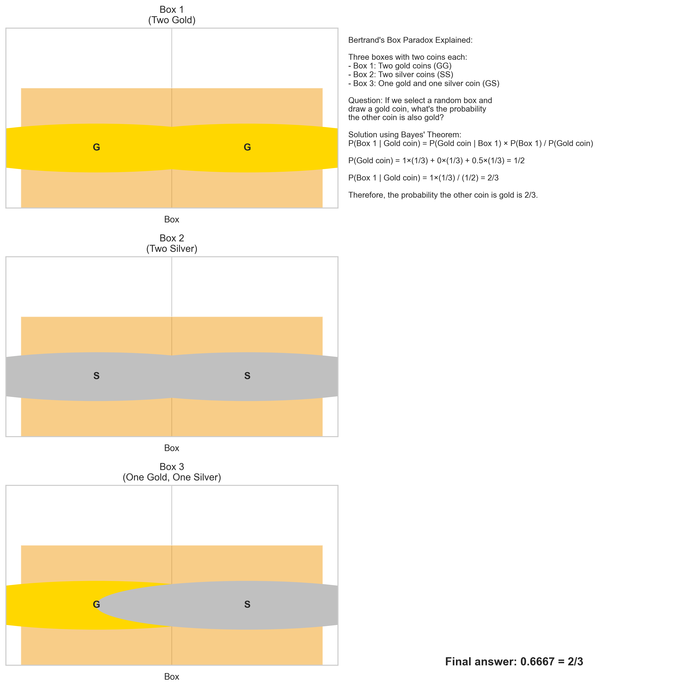
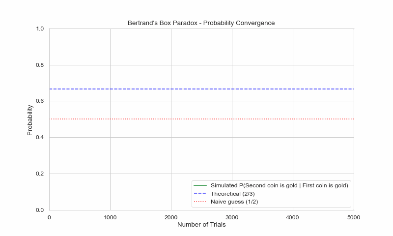

# Probability Puzzles: Simulation and Analysis

*Mathematics Project Report*

---

## Introduction

This report explores two classic probability puzzles through simulation and visualization:

1. **The Monty Hall Problem**: A famous counter-intuitive probability puzzle based on a game show scenario.
2. **Bertrand's Box Paradox**: A classic probability puzzle that demonstrates the subtleties of conditional probability.

Both puzzles showcase situations where intuitive reasoning often leads to incorrect probability assessments. Through simulation and mathematical analysis, we demonstrate the correct solutions and explain why our intuition can lead us astray.

## Puzzle 1: The Monty Hall Problem

### Problem Statement

The Monty Hall problem is named after the host of the television game show "Let's Make a Deal". Here's the scenario:

1. There are three doors, behind one of which is a car (the prize) and behind the other two are goats (no prize).
2. The contestant chooses a door, which remains closed for now.
3. The host, who knows what's behind each door, opens one of the other two doors to reveal a goat.
4. The contestant is then given the option to stick with their original choice or switch to the remaining unopened door.

**Question**: Should the contestant stick with their original choice or switch to increase their chances of winning the car?

### Simulation Approach

We implemented a Monte Carlo simulation to model this problem, running thousands of trials with both strategies (staying with the original choice vs. switching doors) and comparing the win rates.

For each trial, we:
1. Randomly placed the car behind one of the three doors
2. Simulated the contestant's initial random choice
3. Simulated the host revealing a goat behind one of the remaining doors
4. Calculated the outcome for both strategies (stay vs. switch)

### Results

After running 10,000 simulations of each strategy:

- **Stay Strategy**: Win rate of approximately 33.3%
- **Switch Strategy**: Win rate of approximately 66.7%

The simulation results confirm the theoretical probabilities:
- Stay: 1/3 (33.33%)
- Switch: 2/3 (66.67%)

### Mathematical Explanation

The correct solution can be understood by analyzing all possible scenarios:

1. **Initial probability**: The car is randomly placed behind one of three doors, so the initial probability of choosing the correct door is 1/3.

2. **Stay strategy**: If you stick with your original choice, you win if and only if your initial choice was correct. The probability remains 1/3.

3. **Switch strategy**: If you switch, you win if and only if your initial choice was wrong. Since the probability of your initial choice being wrong is 2/3, the probability of winning by switching is also 2/3.

Another way to think about it:
- If you initially picked the car (probability 1/3), switching will make you lose.
- If you initially picked a goat (probability 2/3), the host will reveal the other goat, and switching will make you win.

Therefore, switching gives you a 2/3 chance of winning, while staying gives you a 1/3 chance.

### Visualization

We created visualizations to illustrate the different stages of the game and the outcomes for both strategies:

We also created an animation showing how the win rates converge to their theoretical values as the number of trials increases:

## Puzzle 2: Bertrand's Box Paradox

### Problem Statement

Bertrand's Box Paradox is another classic probability puzzle that demonstrates how conditional probability can be counter-intuitive. Here's the scenario:

1. There are three identical boxes:
   - Box 1 contains two gold coins
   - Box 2 contains two silver coins
   - Box 3 contains one gold coin and one silver coin

2. A box is selected at random, and then a coin is drawn at random from the selected box.

**Question**: If the coin drawn is gold, what is the probability that the other coin in the box is also gold?

### Simulation Approach

We implemented a Monte Carlo simulation to model this problem:

1. Randomly selected one of the three boxes
2. Randomly drew one coin from the selected box
3. For cases where the drawn coin was gold, calculated the frequency with which the second coin was also gold

### Results

After running 10,000 simulations:

- Among trials where the first coin drawn was gold, the second coin was also gold in approximately 66.7% of cases.

The simulation results confirm the theoretical probability of 2/3 (66.67%).

### Mathematical Explanation

The correct solution can be derived using Bayes' theorem:

Let's define the following events:
- B₁, B₂, B₃: Box 1, 2, or 3 was selected (each with probability 1/3)
- G: The drawn coin is gold
- G₂: The second coin in the box is also gold

We need to find P(G₂|G), the probability that the second coin is gold given that the first coin drawn is gold.

Using Bayes' theorem:

P(G₂|G) = P(G₂∩G) / P(G)

First, let's find P(G), the probability of drawing a gold coin:
- From Box 1: P(G|B₁) = 1 (both coins are gold)
- From Box 2: P(G|B₂) = 0 (no gold coins)
- From Box 3: P(G|B₃) = 1/2 (one out of two coins is gold)

P(G) = P(G|B₁)P(B₁) + P(G|B₂)P(B₂) + P(G|B₃)P(B₃) = 1(1/3) + 0(1/3) + (1/2)(1/3) = 1/3 + 1/6 = 1/2

Now, the probability that both the first coin is gold and the second coin is gold:
- From Box 1: P(G₂∩G|B₁) = 1 (both coins are gold)
- From Box 2: P(G₂∩G|B₂) = 0 (no gold coins)
- From Box 3: P(G₂∩G|B₃) = 0 (if first coin is gold, second coin is silver)

P(G₂∩G) = P(G₂∩G|B₁)P(B₁) + P(G₂∩G|B₂)P(B₂) + P(G₂∩G|B₃)P(B₃) = 1(1/3) + 0(1/3) + 0(1/3) = 1/3

Therefore:
P(G₂|G) = P(G₂∩G) / P(G) = (1/3) / (1/2) = 2/3

### Visualization

We created visualizations to illustrate the three boxes and their contents, along with the mathematical reasoning:

We also created an animation showing how the estimated probability converges to the theoretical value as the number of trials increases:

## Code Implementation

The simulation was implemented in Python using the following libraries:
- NumPy for random number generation and mathematical operations
- Matplotlib for creating static visualizations
- Matplotlib's Animation module for creating animated visualizations
- Seaborn for enhanced visualization styling

The code follows an object-oriented approach, with separate simulator classes for each puzzle:
- `MontyHallSimulator`: Implements the Monty Hall problem simulation
- `BertrandsBoxSimulator`: Implements the Bertrand's Box paradox simulation

Each simulator provides methods for:
- Running individual trials
- Running large-scale simulations
- Visualizing results through static plots
- Creating animations to show convergence over time
- Visualizing individual game states to aid understanding

## Conclusion

Both the Monty Hall Problem and Bertrand's Box Paradox demonstrate how our intuition about probability can sometimes lead us astray. In both cases, the correct solutions (switch doors in Monty Hall, and 2/3 probability in Bertrand's Box) are counter-intuitive to many people on first encounter.

Key insights from these puzzles:

1. **Conditional probability** can behave in ways that seem counter-intuitive. Additional information (like the host revealing a goat in Monty Hall) can change the probability landscape in ways that aren't immediately obvious.

2. **Simulation** is a powerful tool for verifying analytical results. Our simulations confirmed the theoretical probabilities for both puzzles.

3. **Visualization** helps in understanding complex probability concepts. The step-by-step visualizations and animations provided clearer insight into why the counter-intuitive answers are correct.

These puzzles highlight the importance of careful probability analysis and the value of simulation in confirming theoretical results, especially when dealing with scenarios where intuition might lead us astray.

## References

1. Selvin, S. (1975). "A problem in probability (letter to the editor)." *The American Statistician*, 29(1), 67.

2. vos Savant, M. (1990). "Ask Marilyn." *Parade Magazine*, 15.

3. Bertrand, J. (1889). *Calcul des probabilités*. Gauthier-Villars.

4. Rosenhouse, J. (2009). *The Monty Hall Problem: The Remarkable Story of Math's Most Contentious Brain Teaser*. Oxford University Press. 